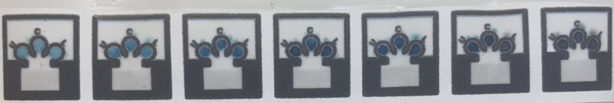
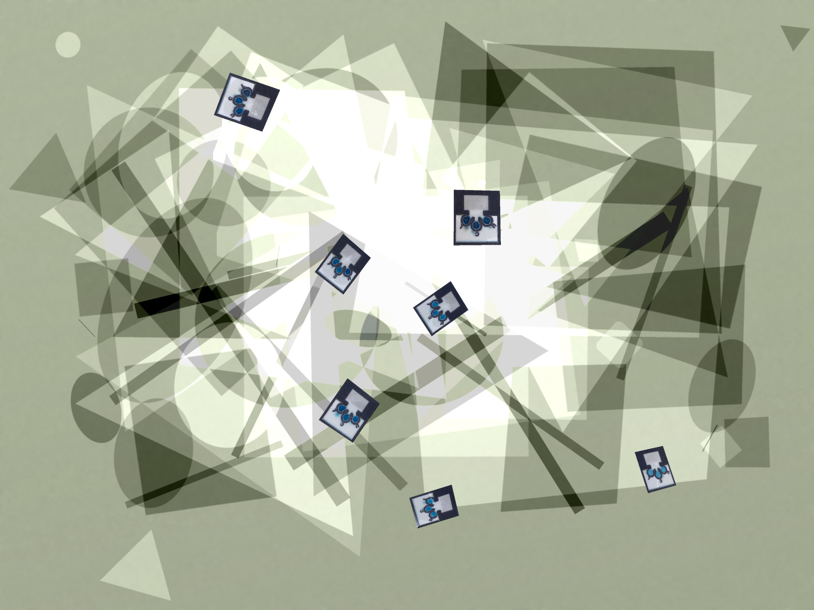
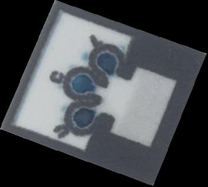
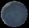

# microPAD colorimetric analysis

A MATLAB-based colorimetric analysis pipeline for microfluidic paper-based analytical devices (microPADs). Processes smartphone images of test strips to extract color features and predict biomarker concentrations (urea, creatinine, lactate) using machine learning.


## Table of Contents
- [Requirements](#requirements)
- [Dataset Structure](#dataset-structure)
- [Pipeline Stages](#pipeline-stages)
- [Quick Start](#quick-start)
- [Data Augmentation](#data-augmentation)
- [Helper Scripts](#helper-scripts)
- [Directory Layout](#directory-layout)
- [Tips and Troubleshooting](#tips-and-troubleshooting)
- [Output Example](#output-example)
- [Future Work: Android Smartphone Application](#future-work-android-smartphone-application)

---

## Requirements

- **MATLAB R2020a or later** with Image Processing Toolbox
- Run scripts from the project folder or `matlab_scripts/` folder

---

## Dataset Structure

### Phone Models & Lighting Conditions

The dataset is organized by **phone model** (e.g., `iphone_11/`, `samsung_a75/`, `realme_c55/`). Each phone captures **7 images per microPAD**, representing different lighting combinations using 3 laboratory lamps:

| Lighting ID | Lamp 1 | Lamp 2 | Lamp 3 | Description |
|-------------|--------|--------|--------|-------------|
| **light_1** | ✓ | ✗ | ✗ | Only lamp 1 |
| **light_2** | ✗ | ✓ | ✗ | Only lamp 2 |
| **light_3** | ✗ | ✗ | ✓ | Only lamp 3 |
| **light_4** | ✓ | ✓ | ✗ | Lamps 1 + 2 |
| **light_5** | ✓ | ✗ | ✓ | Lamps 1 + 3 |
| **light_6** | ✗ | ✓ | ✓ | Lamps 2 + 3 |
| **light_7** | ✓ | ✓ | ✓ | All lamps |

This lighting variation helps the model work well under different real-world lighting conditions.

### microPAD Structure

Each microPAD paper strip contains **7 test zones** (concentrations), and each test zone has **3 elliptical measurement regions**:

- **Final design:** The 3 regions will contain different chemicals (urea, creatinine, lactate)
- **Training phase:** All 3 regions contain the same chemical at the same concentration, providing 3 replicate measurements per concentration level
- This allows separate datasets to be collected for training machine learning models for each chemical

---

## Pipeline Stages

The pipeline processes images through **5 sequential stages**. Each stage reads from folder `N_*` and writes to `(N+1)_*`:

### **Stage 1 → 2: Extract microPAD Paper**

**Script:** `crop_micropad_papers.m`

**Input:** Raw smartphone photos in `1_dataset/{phone_model}/`
**Output:** Cropped paper strips in `2_micropad_papers/{phone_model}/`



Isolates the microPAD paper from the background using interactive rotation and cropping.

---

### **Stage 2 → 3: Cut Concentration Regions**

**Script:** `cut_concentration_rectangles.m`

**Input:** Cropped papers from `2_micropad_papers/`
**Output:** Individual concentration rectangles in `3_concentration_rectangles/{phone_model}/con_{N}/`


Cuts out individual test zones from each paper strip (default: 7 zones per strip).

---

### **Stage 3 → 4: Extract Elliptical Patches**

**Script:** `cut_elliptical_regions.m`

**Input:** Concentration rectangles from `3_concentration_rectangles/`
**Output:** Elliptical patches in `4_elliptical_regions/{phone_model}/con_{N}/`


Extracts three elliptical measurement regions from each test zone. In the final microPAD design, these three regions will contain different chemicals (urea, creatinine, lactate). For training purposes, each experiment fills all three regions with the same concentration of a single chemical, providing three replicate measurements per concentration level.

---

### **Stage 4 → 5: Feature Extraction**

**Script:** `extract_features.m`

**Input:**
- Concentration rectangles from `3_concentration_rectangles/` (used as paper/white reference)
- Elliptical patches from `4_elliptical_regions/`

**Output:** Excel feature tables in `5_extract_features/`


Extracts 80+ colorimetric features from elliptical test zones while compensating for varying lighting conditions using the white paper as a reference. This enables robust biomarker concentration prediction under different smartphone cameras and lighting environments.

---

#### **White Reference Strategy**

The pipeline automatically samples white paper pixels **outside the three elliptical test regions** within each concentration rectangle (shown in green above). These reference pixels provide:

1. **Illuminant estimation** - Determines color temperature of the lighting (2500-10000K)
2. **Chromatic adaptation** - Normalizes color channels to compensate for lighting color cast
3. **Reflectance calculation** - Converts RGB values to relative reflectance ratios
4. **Delta-E baseline** - Measures color difference from paper white point in perceptually-uniform Lab space

This approach makes features **lighting-invariant** across different phone models and laboratory conditions.

---

#### **Available Presets**

```matlab
extract_features('preset','robust','chemical','lactate')  % Recommended
extract_features('preset','minimal')  % Fast, essential features only
extract_features('preset','full')     % All 150+ features
extract_features('preset','custom')   % Interactive feature group selection dialog
```

| Preset | Feature Count | Description |
|--------|---------------|-------------|
| **minimal** | ~30 | Essential color ratios and basic statistics |
| **robust** | ~80 | Comprehensive set balancing accuracy and speed (recommended) |
| **full** | ~150 | All available features including advanced texture analysis |
| **custom** | Variable | User-defined via interactive dialog or struct |

---

#### **Extracted Features (Robust Preset)**

**Color Normalization (Paper-Referenced)**
- RGB ratios relative to paper white point (R/R_paper, G/G_paper, B/B_paper)
- Lab color corrected for paper baseline (L*, a*, b* shifts)
- Delta-E color difference from paper (perceptually uniform)
- Chromatic adaptation factors (von Kries-style)

**Lighting-Invariant Color Ratios**
- Red/Green, Red/Blue, Green/Blue channel ratios
- Hue-based features immune to brightness changes
- Normalized chroma and saturation metrics

**Color Space Statistics**
- RGB: Mean, median, standard deviation per channel
- HSV: Hue, saturation, value distributions
- Lab: Lightness (L*), red-green (a*), blue-yellow (b*) statistics

**Texture and Spatial Features**
- Edge sharpness (gradient magnitude)
- Color uniformity (coefficient of variation)
- Spatial frequency patterns (FFT-based)
- Local color gradients

**Advanced Colorimetry**
- Estimated illuminant color temperature (Kelvin)
- Color purity and dominance wavelength
- Entropy and histogram statistics

---

#### **Output Format**

Excel files with one row per elliptical measurement (replicate):

| PhoneType | ImageName | RG_ratio | delta_E_from_paper | R_paper_ratio | Label |
|-----------|-----------|----------|-------------------|---------------|-------|
| iphone_11 | IMG_0957_aug_000_con_0.jpeg | 0.461 | 32.04 | 0.723 | 0 |
| iphone_11 | IMG_0957_aug_000_con_0.jpeg | 0.460 | 31.51 | 0.719 | 0 |
| iphone_11 | IMG_0957_aug_000_con_0.jpeg | 0.462 | 32.23 | 0.728 | 0 |

- Each concentration zone contributes **3 rows** (3 elliptical replicates)
- `Label` column = known concentration (0-6) for supervised learning
- Automatically exports train/test splits (70/30 default, stratified by image)

---

#### **Parameters**

```matlab
% Chemical name (used in output filename)
extract_features('chemical', 'urea')

% White reference override (if auto-detection fails)
extract_features('paperTempK', 6000)

% Train/test split control
extract_features('trainTestSplit', true, 'testSize', 0.25, 'randomSeed', 42)

% Custom feature selection without dialog
customFeatures = struct('ColorRatios', true, 'PaperNormalization', true);
extract_features('preset', 'custom', 'features', customFeatures, 'useDialog', false)
```

---

#### **Machine Learning Integration**

The extracted features are designed for training AI models that will:
1. **Predict biomarker concentrations** from smartphone images
2. **Run on Android smartphones** via embedded TensorFlow Lite models
3. **Auto-detect test zones** using polygon detection networks

**Typical ML workflow:**
```matlab
% 1. Extract features in MATLAB
extract_features('preset','robust','chemical','lactate')

% 2. Load train/test splits in Python
train_df = pd.read_excel('5_extract_features/robust_lactate_train_features.xlsx')
test_df = pd.read_excel('5_extract_features/robust_lactate_test_features.xlsx')

% 3. Train regression model
X_train = train_df.drop(['PhoneType','ImageName','Label'], axis=1)
y_train = train_df['Label']
model = RandomForestRegressor()
model.fit(X_train, y_train)

% 4. Export for Android deployment
# Convert to TensorFlow Lite for smartphone inference
```

---

## Quick Start

Run these commands **in order** from the project folder:

### Full Pipeline (from raw images)

```bash
# Stage 1: Crop microPAD papers
matlab -batch "addpath('matlab_scripts'); crop_micropad_papers;"

# Stage 2: Cut concentration rectangles (7 regions per strip)
matlab -batch "addpath('matlab_scripts'); cut_concentration_rectangles;"

# Stage 3: Extract elliptical regions
matlab -batch "addpath('matlab_scripts'); cut_elliptical_regions;"

# Stage 4: Extract features (reads both 3_ and 4_; change 'lactate' to your chemical name)
matlab -batch "addpath('matlab_scripts'); extract_features('preset','robust','chemical','lactate');"
```

### Typical Workflow (starting from Stage 2)

If you already have cropped papers in `2_micropad_papers/`:

```bash
matlab -batch "addpath('matlab_scripts'); cut_concentration_rectangles;"
matlab -batch "addpath('matlab_scripts'); cut_elliptical_regions;"
matlab -batch "addpath('matlab_scripts'); extract_features('preset','robust','chemical','lactate');"
```

---

## Data Augmentation

**Script:** `augment_dataset.m` (optional, recommended for AI training)

Generates synthetic training data by transforming Stage 2 outputs (papers and polygons) and composing them onto procedural backgrounds. Essential for training robust polygon detection models for the Android smartphone application.


*Synthetic scene with transformed microPAD under simulated lighting*


*Augmented concentration region with perspective distortion*


*Augmented elliptical patch preserving colorimetric properties*

---

### **Why Augmentation is Critical**

The final Android application will use AI-based **auto-detection** to locate test zones in smartphone photos. This requires training data with:

1. **Diverse viewpoints** - Different camera angles and distances
2. **Variable lighting** - Different color temperatures and brightness levels
3. **Realistic backgrounds** - Laboratory surfaces, skin, various materials
4. **Occlusions and artifacts** - Objects partially covering the test strip
5. **Multiple phone cameras** - Cross-device generalization

Augmentation **multiplies the training dataset** by 5-10x without requiring additional physical experiments.

---

### **Transformation Pipeline**

**Geometric Transformations (per paper)**
1. **3D perspective projection** - Simulates camera viewing angles (+/-60 deg pitch/yaw) and back-projects Stage 2 strip coordinates into Stage 1 image space before augmentation
2. **Rotation** - Random orientation (0-360 deg)
3. **Spatial placement** - Random non-overlapping positions via grid acceleration
4. **Optional per-region rotation** - Independent orientation for each concentration zone

**Photometric Augmentation**
- **Brightness/contrast** - Global illumination variation (±5-10%)
- **White balance jitter** - Per-channel gains simulating different lighting (0.92-1.08x)
- **Saturation adjustment** - Color intensity variation (0.94-1.06x)
- **Gamma correction** - Exposure simulation (0.92-1.08)

**Background Generation (Procedural)**
- **Uniform surfaces** - Clean laboratory benches (220 +/- 15 RGB)
- **Speckled textures** - Granite, composite materials
- **Laminate** - High-contrast white/black surfaces (245 or 30 RGB)
- **Skin tones** - Human hand/arm backgrounds (HSV-based)
- **Texture pooling** - 16 cached variants per surface type with random shifts, flips, and scale jitter to avoid regeneration artifacts

**Distractor Artifacts (5-40 per image)**
- **Shapes**: Ellipses, rectangles, quadrilaterals, triangles, lines
- **Sizes**: 1-75% of image diagonal (allows partial occlusions)
- **Placement**: Unconstrained (can extend beyond frame)
- **Sharpness**: Sharp by default, matching concentration rectangle behavior
- **Rendering**: Nearest-neighbor interpolation to preserve crisp edges
- **Purpose**: Train polygon detector to ignore false positives while maintaining realistic appearance

**Blur and Occlusions (Optional)**
- **Scene-wide blur** - Applied to entire image (polygons + artifacts) when enabled
- **Motion blur** - Camera shake simulation (15% probability)
- **Gaussian blur** - Focus variation (25% probability, sigma 0.25-0.65px)
- **Thin occlusions** - Hair/strap-like artifacts across test zones (disabled by default)

---

### **Usage Examples**

```matlab
% Basic usage: 5 augmented versions per paper (6 total with original)
augment_dataset('numAugmentations', 5, 'rngSeed', 42)

% High-augmentation mode for deep learning (10x data)
augment_dataset('numAugmentations', 10, 'photometricAugmentation', true)

% Enable all augmentation features
augment_dataset('numAugmentations', 5, ...
                'photometricAugmentation', true, ...
                'blurProbability', 0.30, ...
                'motionBlurProbability', 0.20, ...
                'occlusionProbability', 0.15, ...
                'independentRotation', true)

% Fast mode: disable expensive features
augment_dataset('numAugmentations', 3, ...
                'photometricAugmentation', false, ...
                'independentRotation', false)

% Reproducible augmentation for ablation studies
augment_dataset('numAugmentations', 5, 'rngSeed', 12345)

% Emit JSON labels for CornerNet-style training
augment_dataset('numAugmentations', 5, 'exportCornerLabels', true)
```

---

### **Performance**

**Speed**: ~1.0 second per augmented image (3x faster than v1)
- Grid-based spatial acceleration (O(1) collision detection vs O(n^2))
- Simplified polygon warping (nearest-neighbor vs bilinear)
- Background texture pooling (reuses 4 procedural types with cached surfaces instead of regenerating each frame)

**Memory**: Low overhead
- Processes one paper at a time
- Temporary buffers released after each scene

**Scalability**: Handles large datasets
- Automatic background expansion if polygons don't fit
- Graceful degradation on positioning failures

---

### **Input/Output Structure**

**Inputs:**
- `2_micropad_papers/{phone}/` - Cropped paper strip images
- `3_concentration_rectangles/{phone}/coordinates.txt` - Polygon vertices (required)
- `4_elliptical_regions/{phone}/coordinates.txt` - Ellipse parameters (optional)

**Outputs:**
- `augmented_1_dataset/{phone}/` - Full synthetic scenes (for polygon detector training)
- `augmented_2_concentration_rectangles/{phone}/con_{N}/` - Transformed concentration regions + coordinates.txt
- `augmented_3_elliptical_regions/{phone}/con_{N}/` - Transformed elliptical patches + coordinates.txt (if input ellipses exist)

**Naming convention:**
- Original: `paper_name_aug_000.jpg` (identity transformations)
- Augmented: `paper_name_aug_001.jpg`, `paper_name_aug_002.jpg`, etc.

---

### **Integration with ML Pipeline**

**For Polygon Detection (YOLO, Faster R-CNN)**
```python
# Train on augmented_1_dataset/ with bounding boxes from coordinates.txt
# Polygon vertices → bounding boxes for object detection
```

**For Concentration Prediction (Regression Models)**
```matlab
% Extract features from augmented data
extract_features('preset','robust','chemical','lactate')
% Output: 5_extract_features/ with (N+1) × original sample count
```

**For Android Deployment**
1. Train polygon detector on `augmented_1_dataset/`
2. Export to TensorFlow Lite (.tflite)
3. Train concentration predictor on features from augmented ellipses
4. Embed both models in Android app

---

### **Important Notes**

**Ellipse coordinate propagation:**
- If `4_elliptical_regions/coordinates.txt` is missing, augmentation still runs but only produces stages 1-2
- To generate augmented ellipses without pre-existing coordinates, run `cut_elliptical_regions.m` on `augmented_2_concentration_rectangles/` after augmentation

**Coordinate preservation:**
- All transformations (perspective, rotation, translation) are recorded in output coordinates.txt files
- Ellipse transformations use conic section mathematics to preserve accuracy
- Coordinates are validated (degenerate ellipses/polygons are skipped with warnings)

**Quality control:**
- Original version (aug_000) uses identity transformations for debugging
- Photometric augmentation is color-safe (preserves relative hue relationships)
- At most one blur type is applied per image (prevents over-softening)

---

## Helper Scripts

Three utility scripts in `matlab_scripts/helper_scripts/` for recreating images and checking quality:

### **extract_images_from_coordinates.m**

Recreates all processed images from `coordinates.txt` files. Instead of saving thousands of image files, you only need to keep small text files with coordinates.

**Why this matters:**
- You don't need to save processed images (stages 2-4) - just keep the `coordinates.txt` files
- Anyone can recreate the exact same images from the coordinates
- Saves storage space (gigabytes → kilobytes)

**Usage:**
```matlab
addpath('matlab_scripts/helper_scripts');
extract_images_from_coordinates();
```

Run this script to recreate any missing processed images from your saved coordinates.

---

### **preview_overlays.m**

Opens a viewer that shows how well your coordinates match the actual images. Displays rectangles, polygons, and ellipses overlaid on the original photos.

**Use this to:**
- Check if your annotations are accurate
- Find mistakes before extracting features
- Verify your work after editing `coordinates.txt` files

**Usage:**
```matlab
addpath('matlab_scripts/helper_scripts');
preview_overlays();  % Press 'n' to navigate, 'q' to quit
```

---

### **preview_augmented_overlays.m**

Same as `preview_overlays.m`, but for checking the augmented (synthetic) dataset quality.

**Usage:**
```matlab
addpath('matlab_scripts/helper_scripts');
preview_augmented_overlays();
```

---

## Directory Layout

```
microPAD-colorimetric-analysis/
├── matlab_scripts/          # Main processing scripts
│   ├── crop_micropad_papers.m
│   ├── cut_concentration_rectangles.m
│   ├── cut_elliptical_regions.m
│   ├── extract_features.m
│   ├── augment_dataset.m
│   └── helper_scripts/      # Utility functions
├── 1_dataset/               # Raw smartphone photos
│   ├── iphone_11/
│   ├── iphone_15/
│   ├── realme_c55/
│   └── samsung_a75/
├── 2_micropad_papers/       # Cropped paper strips
├── 3_concentration_rectangles/  # Concentration regions + coordinates.txt
├── 4_elliptical_regions/    # Elliptical patches + coordinates.txt
├── 5_extract_features/      # Feature tables (.xlsx)
├── augmented_1_dataset/     # (Optional) Synthetic scenes
├── augmented_2_concentration_rectangles/
├── augmented_3_elliptical_regions/
└── demo_images/             # Visual examples for documentation
```

**Note:** The processed images are not saved to version control (only the `coordinates.txt` files are saved).

---

## Tips and Troubleshooting

### Coordinate Files

Each stage saves a `coordinates.txt` file with position and shape information:
- **Stage 2:** Paper location and rotation
- **Stage 3:** Corner points of each test zone
- **Stage 4:** Ellipse center, size, and rotation

**If corrupted:** Delete the file and re-run the stage to create a new one.

### Memory Issues

If MATLAB runs out of memory, process fewer images at once:

```matlab
extract_features('preset', 'robust', 'batchSize', 10)
```

### Running from the Wrong Folder

If you see warnings about missing folders, make sure you're running scripts from:
- The main project folder, OR
- The `matlab_scripts/` folder

### Testing Before Full Processing

Before processing all images, test with 2-3 sample images to make sure everything works correctly.

---

## Output Example

Sample rows from `5_extract_features/robust_lactate_t0_features.xlsx` (showing subset of 80+ feature columns):

| PhoneType  | ImageName                   | RG_ratio | RB_ratio | GB_ratio | L       | a       | b      | delta_E_from_paper | R_paper_ratio | Label |
|------------|-----------------------------|----------|----------|----------|---------|---------|--------|--------------------|---------------|-------|
| iphone_11  | IMG_0957_aug_000_con_0.jpeg | 0.461449 | 0.360812 | 0.781910 | 53.9623 | 10.3421 | 18.952 | 32.0361            | 0.7234        | 0     |
| iphone_11  | IMG_0957_aug_000_con_0.jpeg | 0.460265 | 0.365116 | 0.793272 | 54.0647 | 10.1204 | 19.124 | 31.5070            | 0.7189        | 0     |
| iphone_15  | IMG_1234_aug_000_con_3.jpeg | 0.483148 | 0.388192 | 0.803463 | 55.1563 | 11.8934 | 20.456 | 30.2742            | 0.7512        | 3     |
| realme_c55 | IMG_5678_aug_000_con_5.jpeg | 0.492301 | 0.395421 | 0.810234 | 56.2341 | 12.4567 | 21.345 | 29.1234            | 0.7634        | 5     |
| samsung_a75| IMG_9012_aug_000_con_6.jpeg | 0.501234 | 0.402345 | 0.821345 | 57.3456 | 13.2345 | 22.456 | 28.3456            | 0.7789        | 6     |

**Notes:**
- Each row represents one elliptical region measurement (replicate)
- Multiple rows with the same concentration indicate replicate measurements from the 3 elliptical regions within that test zone
- `Label` column shows the known concentration (0-6) for training the model
- During training, all 3 replicates per test zone contain the same chemical at the same concentration
- Full table has 80+ columns (only some shown above)
- Can split data into separate training and testing files

---

## Future Work: Android Smartphone Application

This MATLAB pipeline serves as the **data preparation and training infrastructure** for an Android smartphone application that will:

1. **Capture microPAD photos** using the smartphone camera
2. **Auto-detect test zones** using polygon detection AI (trained on `augmented_1_dataset/`)
3. **Predict biomarker concentrations** (urea, creatinine, lactate) using regression models (trained on features from `5_extract_features/`)
4. **Display results** to the user in real-time

### **AI Model Training Workflow**

```
MATLAB Pipeline (this repository)
    ↓
augmented_1_dataset/ → Train polygon detector (YOLO/Faster R-CNN)
    ↓
5_extract_features/ → Train concentration predictor (Random Forest/XGBoost)
    ↓
Export to TensorFlow Lite (.tflite)
    ↓
Android Application (separate repository, coming soon)
```

### **Key Features of Android App**

- **Real-time detection** - Auto-locate test zones in live camera feed
- **Lighting compensation** - White reference strategy (same as MATLAB pipeline)
- **Multi-biomarker support** - Separate models for urea, creatinine, lactate
- **Offline inference** - Embedded TensorFlow Lite models (no internet required)
- **Result history** - Save and track measurements over time

### **Current Status**

✅ **Completed**: MATLAB data preparation pipeline (this repository)
🔄 **In Progress**: AI model training and validation
📋 **Planned**: Android application development

Stay tuned for the Android app repository link!
